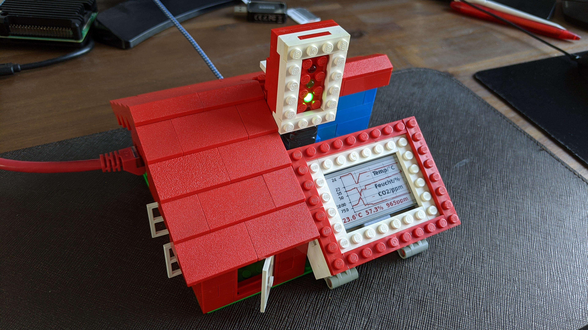
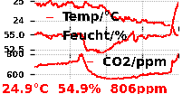
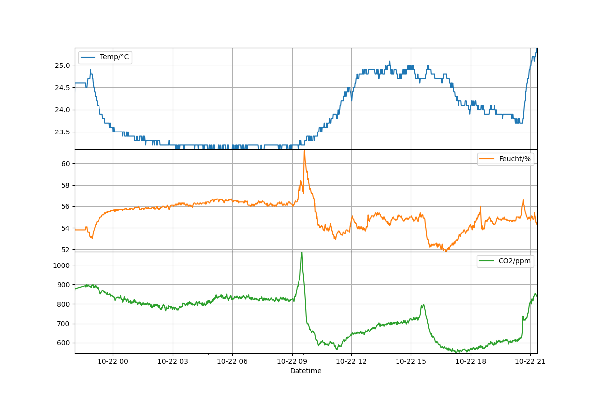
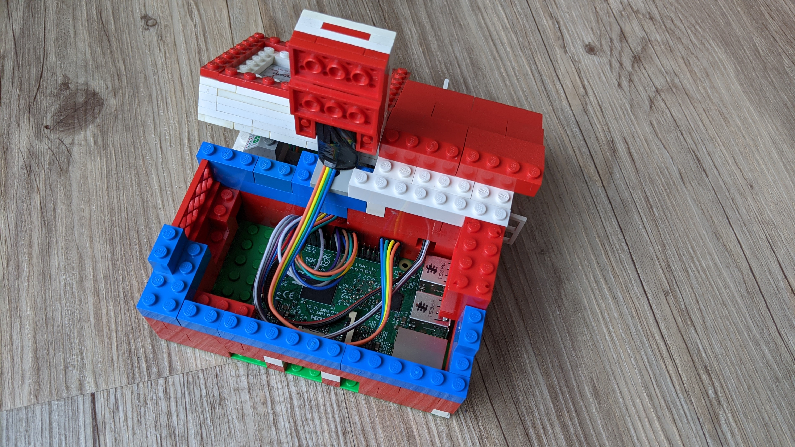
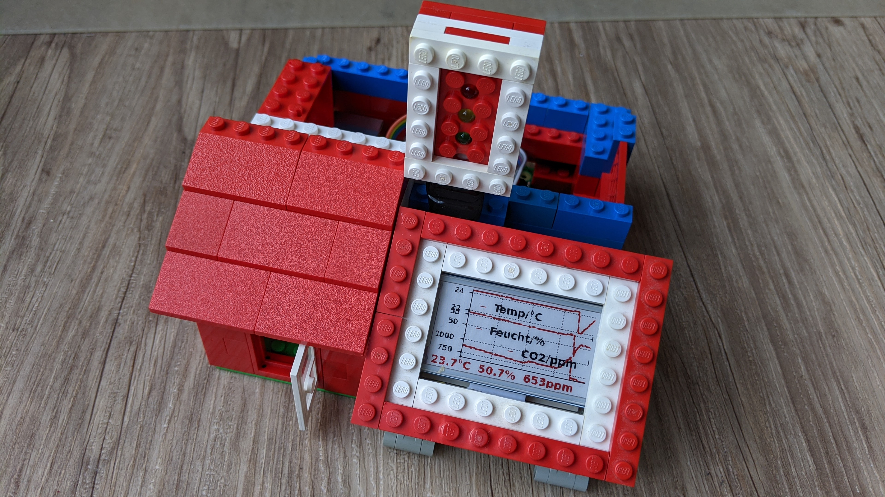
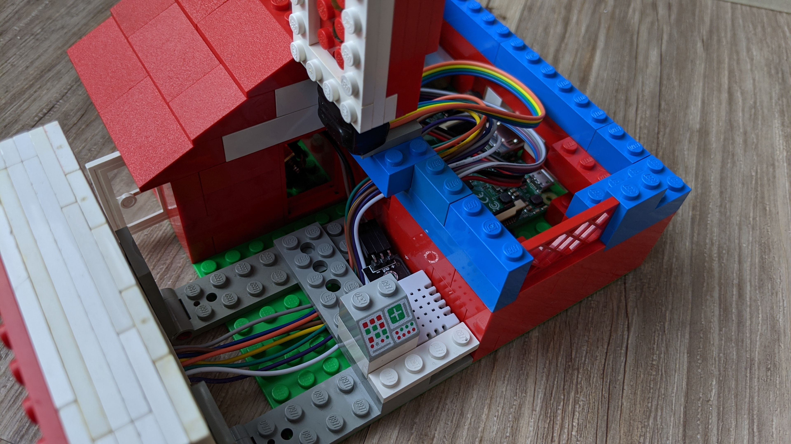
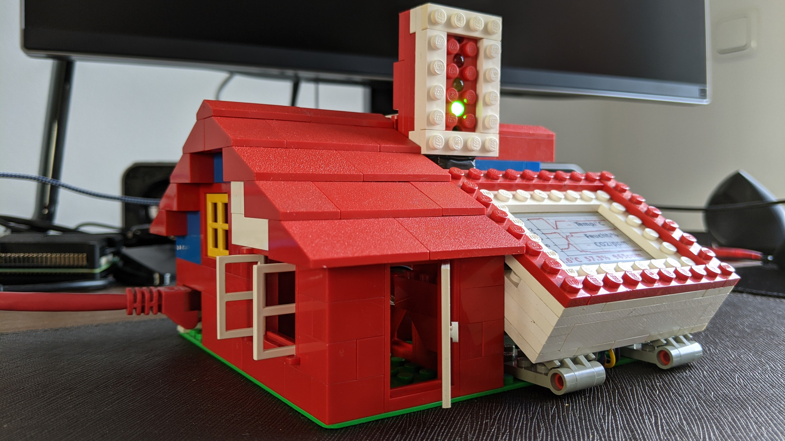

# CO<sub>2</sub>-, Temperatur- und Luftfeuchtigkeitsmonitor
von Gero und Maik Brinkmeier, Oktober 2020

## Einleitung
Raspberry Pi Datenlogger im Lego-Gehäuse für CO<sub>2</sub>, Temperatur und Luftfeuchtigkeit mit den Sensoren
* MH-Z19B https://pypi.org/project/mh-z19/,
* DHT22/AM2302 https://www.einplatinencomputer.com/raspberry-pi-temperatur-und-luftfeuchtigkeitssensor-dht22/,

einem schwarz-rotem E-Paper Display,
* https://www.waveshare.com/wiki/2.13inch_e-Paper_HAT_(B),

und einer CO<sub>2</sub> Ampel mit roter, gelber und grüner Leuchtdiode.



Das Display zeigt jede Minute mit drei Kurven die Temperatur, Luftfeuchte und CO<sub>2</sub> Konzentration der letzten maximal 8 Stunden an:



Eine detailiertere Darstellung der Messdaten kann mit `analyse_data.py` erstellt werden:



Basierend auf dem letzten CO<sub>2</sub>-Wert wird die Ampelfarbe umgeschaltet:
Ampelfarbe | CO<sub>2</sub> Konzentration / ppm | Bedeutung
---------- | ---------------------------------- | ---------
grün       | x < 1000                           | Luftqualität gut
gelb       | 1000 <= x < 1500                   | Lüftung empfohlen 
rot        | x >= 1500                          | Lüftung notwendig

Siehe auch: [Bekanntmachung des Umweltbundesamtes zu Kohlendioxid in der Innenraumluft](https://www.umweltbundesamt.de/sites/default/files/medien/pdfs/kohlendioxid_2008.pdf). 

## Installationsschritte
* Die Sensoren und das e-Paper Display, wie oben in den Links beschrieben, am Raspberry Pi GPIO anschließen.
* Für die Ampel werden je eine rote, gelbe und grüne LED mit Vorwiderstand an folgenden GPIO Pins und Masse angeschlossen, siehe ampel.py:
  ````python
  # BCM pins
  Prot   = 21
  Pgruen = 16
  Pgelb  = 20
  ````
  Für die Bezeichnung der GPIO Pins, siehe https://de.pinout.xyz/

* [Raspberry Pi OS lite ohne Monitor und Tastatur headless einrichten](https://www.tutonaut.de/anleitung-raspberry-pi-ohne-monitor-und-tastatur-headless-einrichten/)
* SSH-Verbindung mit Putty oder MobaXterm herstellen
* `sudo raspi-config`
  * Passwort ändern
  * optional Hostname ändern
  * SPI aktivieren für E-Paper Modul https://www.waveshare.com/wiki/2.9inch_e-Paper_Module_(B)
  * Serial Port aktivieren für CO2 Sensor https://github.com/UedaTakeyuki/mh-z19/wiki/How-to-Enable-Serial-Port-hardware-on-the-Raspberry-Pi
  * Finish und Reboot, dann bei neuem Hostname neu verbinden

* Git und Python3 Pakete installieren
  ````sh
  sudo apt install git python3-pip python3-pil python3-pandas python3-matplotlib
  ````
* pip installieren und Python3 Tools upgraden
  ````sh
  sudo python3 -m pip install --upgrade pip setuptools wheel
  ````  
* Python3 Pakete installieren
  ````sh
  sudo pip3 install RPi.GPIO spidev Adafruit_DHT mh-z19
  ````    
* e-Paper Treiber GitHub Seite von Waveshare https://github.com/waveshare/e-Paper
  ````sh
  sudo git clone https://github.com/waveshare/e-Paper
  cd e-Paper/RaspberryPi\&JetsonNano/
  sudo python3 setup.py install
  ````
* Unterordner "devel" erstellen und dieses Repository mit git klonen
  ````sh  
  cd ~
  mkdir devel
  cd devel
  git clone https://github.com/ego1105/co2_monitor.git  
  ````
* Cronjob erstellen, der co2_monitor.sh jede Minute aufruft
  ````sh  
  crontab -e
  # m h  dom mon dow   command
  * * * * * /home/pi/devel/co2_monitor/co2_monitor.sh
  ````    

  
## Weitere Bilder







